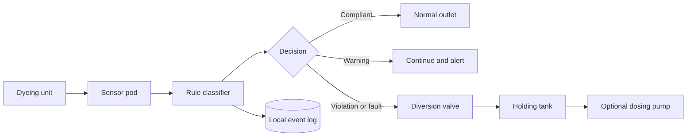
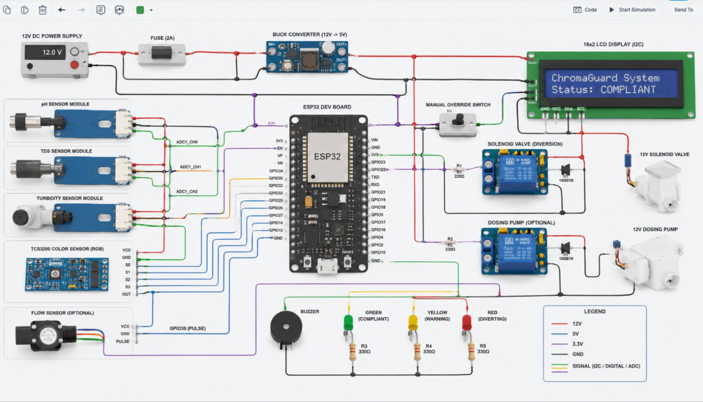
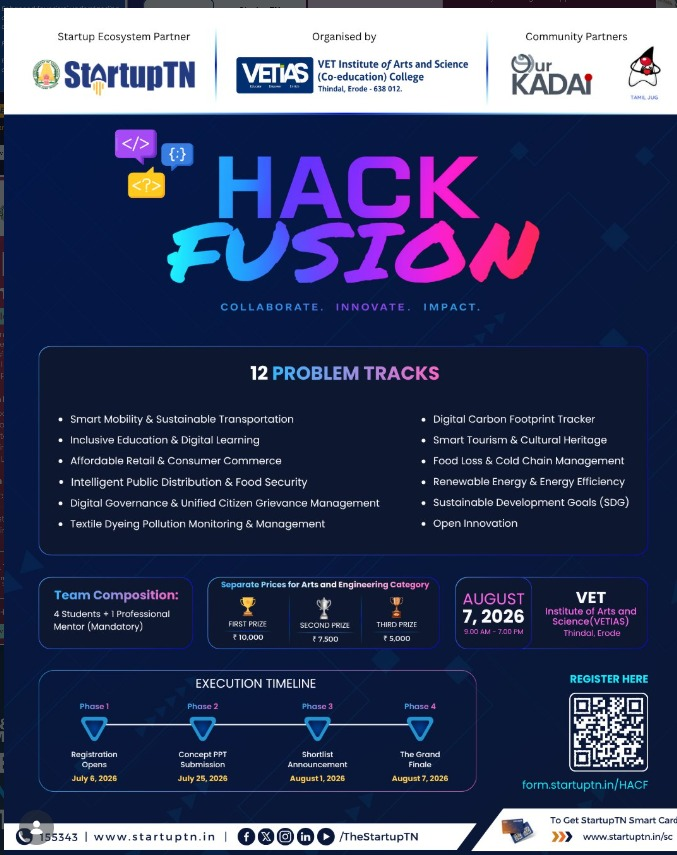

# ChromaGuard

ESP32 effluent compliance prototype for the **Textile Dyeing Pollution Monitoring & Management** track at Hack Fusion 2026.

ChromaGuard reads pH, TDS, turbidity, colour intensity, and flow. A rule-based classifier checks each sample. If a critical limit fails, the state machine switches the simulated valve from normal discharge to a holding tank and records the event.

**[Open the interactive demo](https://adithya-hmt.github.io/chromaguard-hackfusion-2026/)**

The demo runs in a browser. Judges can select fixed test scenarios, change operating modes, control the valve and pump, inspect sensor history, and export the event log. It does not need an account, API key, or backend.

> Current status: the browser and Wokwi builds use simulated inputs. ChromaGuard has not been field-calibrated or approved for industrial use.

## Demo checklist

| Select | Expected result |
|---|---|
| Normal compliant discharge | Normal outlet remains open |
| High TDS violation | Diversion valve opens |
| Acidic or alkaline pH | Diversion valve opens |
| High turbidity or colour | Diversion valve opens |
| Sensor disconnected | System enters `SENSOR_FAULT` and follows the configured safe response |
| Maintenance bypass | Override remains visible and is written to the event log |
| Holding tank nearly full | Inlet closes instead of routing more water to the tank |
| Normal discharge after diversion | Valve returns to normal after two compliant samples |

Detailed walkthrough: [docs/demo-script.md](docs/demo-script.md)

## Control loop



The valve logic lives in `src/simulation/engine.ts`. It applies a minimum diversion hold and requires consecutive compliant samples before reopening the normal route. The same rule thresholds are mirrored in the ESP32 classifier.

## Prototype thresholds

| Reading | Warning | Violation |
|---|---:|---:|
| pH | — | below 6.5 or above 8.5 |
| TDS | above 1,500 mg/L | above 2,100 mg/L |
| Turbidity | above 20 NTU | above 50 NTU |
| Colour intensity | above 55 | above 78 |

One critical reading causes `NON_COMPLIANT`. Two simultaneous warnings also cause `NON_COMPLIANT`. Missing or implausible input causes `SENSOR_FAULT`.

These are prototype settings. The pH and TDS values are based on the CPCB textile-effluent table, subject to its disposal, reuse, intake-water, and local-board conditions. Turbidity and TCS3200 colour values are simulation settings. See [regulatory context](docs/evidence-and-regulatory-context.md).

## Hardware model



The intended build uses an ESP32, pH/TDS/turbidity probes, a TCS3200 colour sensor, an optional flow sensor, a 12 V solenoid valve, three status LEDs, a buzzer, and an optional dosing pump. Wokwi uses potentiometers in place of water probes.

The circuit image is a design reference. Before connecting a physical valve, the build needs electrical isolation, a protected driver, flyback suppression, fusing, an emergency stop, tank-level interlocks, and a qualified safety review.

## Run locally

```bash
npm install
npm run dev
```

Release checks:

```bash
npm run typecheck
npm test -- --run
npm run build
```

Browser state and event history are stored in `localStorage`.

## Repository

| Path | Contents |
|---|---|
| `src/simulation/` | Classifier, state machine, scenarios, telemetry |
| `src/App.tsx` | Interactive dashboard |
| `tests/` | Deterministic classifier and state tests |
| `firmware/chromaguard/` | ESP32 sketch and C++ classifier |
| `simulation/wokwi/` | Wokwi circuit and instructions |
| `sample-data/` | Normal, violation, and sensor-fault runs |
| `docs/` | Hardware, calibration, evidence, costs, and demo notes |
| `.github/workflows/` | Tests and GitHub Pages deployment |

## Hack Fusion 2026

- **Final:** 7 August 2026, 9:00 AM to 7:00 PM
- **Venue:** VET Institute of Arts and Science, Thindal, Erode
- **Organisers:** VETIAS and StartupTN
- **Team format:** four students and one professional mentor
- **Concept deadline:** 25 July 2026
- **Shortlist:** 1 August 2026
- **Prizes:** ₹10,000, ₹7,500, and ₹5,000
- **Registration:** [form.startuptn.in/HACF](https://form.startuptn.in/HACF)



## Team Technoz

- Manieswari M. V., Team Leader, EEE
- Poojasree P., EEE
- Prathiksha S., EEE
- Adithya S., CSE
- Anantha Balan R., CSE
- R. Sivaprasad, Faculty Mentor

The event registration defines the official four-student competition roster. The list above credits project contributors. Institutional contacts are in [docs/team.md](docs/team.md).

## Scope

The repository proves the software workflow and firmware logic. It does not prove sensor accuracy, valve reliability, treatment performance, tamper resistance, regulatory compliance, or a trained ML model. Those require physical hardware, labelled samples, laboratory comparison, and site-specific review.

The pilot plan and cost estimates are documented in [docs/hackathon-brief.md](docs/hackathon-brief.md) and [docs/bill-of-materials.md](docs/bill-of-materials.md).

## Licence

MIT. See [LICENSE](LICENSE).
