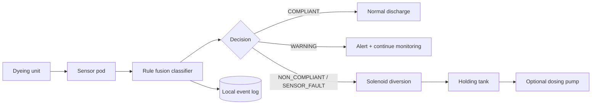

# ChromaGuard

## Effluent Compliance System · Hack Fusion 2026

**Problem track:** Textile Dyeing Pollution Monitoring & Management

> We don't just detect pollution. We stop it at the pipe.

[Live simulation](https://adithya-hmt.github.io/chromaguard-hackfusion-2026/) · [Judge demo](docs/demo-script.md) · [ESP32/Wokwi setup](simulation/wokwi/README.md) · [Technical brief](docs/hackathon-brief.md)

Textile effluent is often verified after it has already left the discharge pipe. ChromaGuard demonstrates a direct response: sense water quality, classify it with visible rules, decide the route, actuate diversion, and record the event. The browser twin lets judges reproduce that complete loop without an account, backend, paid API, or physical sensor kit.

ChromaGuard is an ESP32-oriented prototype for textile dye effluent. It continuously senses pH, TDS, turbidity, colour intensity, and flow; applies a documented rule classifier; decides the outlet route; drives a diversion valve on non-compliance; and records an auditable event log.

> **Prototype notice:** the browser uses simulated sensor data and this project is not a replacement for an effluent treatment plant, regulatory approval, or certified instrumentation. Thresholds are prototype defaults. Final limits require applicable TNPCB/CPCB review, field samples, calibration, and safety validation.

## Hack Fusion 2026


- **Grand finale:** 7 August 2026, 9:00 AM–7:00 PM
- **Venue:** VET Institute of Arts and Science, Thindal, Erode
- **Organised by:** VETIAS with StartupTN
- **Team format:** four students and one professional mentor
- **Concept PPT deadline:** 25 July 2026
- **Shortlist announcement:** 1 August 2026
- **Prizes:** ₹10,000 / ₹7,500 / ₹5,000
- **Registration:** [form.startuptn.in/HACF](https://form.startuptn.in/HACF)

See the concise [event and submission context](docs/hackfusion-2026-event.md).

## The problem

A dashboard that only reports a violation leaves the discharge path open. ChromaGuard makes the control action explicit: in automatic mode, `NON_COMPLIANT` or `SENSOR_FAULT` enters the fail-safe route and commands diversion before the normal outlet. A full holding tank closes the valve and raises a visible fault instead of pretending the tank can accept more flow.

## Hardware concept

The supplied Tinkercad-style circuit reference shows the intended prototype: fused 12 V supply, buck conversion for the ESP32, pH/TDS/turbidity probes, TCS3200 colour sensing, optional flow sensing, I2C LCD, maintenance override, solenoid diversion valve, optional dosing pump, buzzer, and green/yellow/red status outputs.


The image is a system reference, not a production wiring approval. The Wokwi pin map and current firmware configuration are authoritative for the simulation; validate power domains, isolation, relay drivers, flyback protection, grounding, and emergency shutdown before connecting a live valve.

## Sense → Classify → Decide → Act → Log



## Live demo

The public repository is [adithya-hmt/chromaguard-hackfusion-2026](https://github.com/adithya-hmt/chromaguard-hackfusion-2026). After the Pages workflow completes, the simulation is available at [adithya-hmt.github.io/chromaguard-hackfusion-2026](https://adithya-hmt.github.io/chromaguard-hackfusion-2026/).

## Run locally

```bash
npm install
npm run dev
```

The simulation is offline after the app loads. State and events are stored in the browser's localStorage. Run `npm run typecheck`, `npm test -- --run`, and `npm run build` for the release checks.

## Demo scenarios

Use the scenario console to reproduce normal, high TDS, acidic/alkaline pH, high turbidity, abnormal colour, severe mixed contamination, sensor disconnect, maintenance bypass, and holding-tank-full states. The event log supports search, filtering, CSV export, and confirmed clearing.

## Judge-ready demo path

1. Open the [live digital twin](https://adithya-hmt.github.io/chromaguard-hackfusion-2026/) and point out that it works without authentication or a backend.
2. Run **Normal compliant discharge** and show the green normal outlet route.
3. Run **High TDS violation** and show the red diversion route, triggered rule, tank level, and audit event.
4. Run **Sensor disconnected** to demonstrate fail-safe diversion instead of silent bad data.
5. Enable **Maintenance bypass** and show that the override is visible and logged.
6. Restore normal readings twice; the state machine releases diversion only after consecutive compliant samples.
7. Export the event log CSV, then open the Wokwi firmware simulation to show matching serial telemetry.

### Why this submission is credible

- The valve is part of the state machine; this is not a passive monitoring dashboard.
- Ten deterministic scenarios make every safety path reproducible for judges.
- Automated tests cover classification, diversion, recovery, bypass logging, sensor faults, and tank capacity.
- Browser and firmware rules are documented side by side.
- The repository makes no claim of trained ML, certification, field calibration, or regulatory approval.

## Repository map

- `src/simulation/` — TypeScript classifier, state machine, scenarios, and telemetry helpers.
- `src/App.tsx` — responsive control-room dashboard.
- `firmware/chromaguard/` — Arduino-compatible ESP32 sketch and shared rule model.
- `simulation/wokwi/` — Wokwi diagram and setup notes.
- `docs/` — architecture, calibration, limits, BOM, testing, and demo script.
- `.github/workflows/` — test/build and GitHub Pages deployment.

## Classification model

Prototype defaults: pH 6.5–8.5; TDS warning/violation at 1,500/2,100 mg/L; turbidity warning/violation at 20/50 NTU; configurable colour thresholds at 55/78. A critical single-sensor rule diverts. Two warnings escalate to non-compliant. Missing or implausible critical input is `SENSOR_FAULT`. This is rule-based confidence, not an ML probability. An ML classifier is a future upgrade only after labelled real-world samples exist.

The pH and TDS violation values align with the published CPCB textile-effluent table, but this prototype does not treat one table as universal permission to discharge. Disposal mode, intake-water quality, recipient conditions, TNPCB directions, reuse/ZLD obligations, and field calibration can require different or stricter limits. See [`docs/evidence-and-regulatory-context.md`](docs/evidence-and-regulatory-context.md).

## Hardware and Wokwi

The target build uses an ESP32, pH/TDS/turbidity probes, TCS3200 RGB sensor, optional flow sensor, 12 V solenoid, optional dosing pump, three status LEDs, buzzer, and bypass switch. Wokwi substitutes potentiometers for analogue sensors; see [`simulation/wokwi/README.md`](simulation/wokwi/README.md).

## GitHub Pages deployment

Push the repository to GitHub with the name `chromaguard-hackfusion-2026`. Enable Pages with **GitHub Actions** as the source. The workflow installs dependencies, typechecks, tests, builds with the configured base path, and deploys `dist/`.

## Pilot path and sustainability

The deck proposes a staged route: calibrate one outflow-line prototype, pilot with two or three member units connected to one CETP, validate the optional holding/dosing buffer, and only then pursue a regulator-backed rollout. Possible future revenue is hardware sale or lease plus calibration/maintenance services. A hosted compliance service is a future business option—not part of this local-only repository.

Prototype planning ranges are documented as estimates, not quotes: ₹3,100–₹4,400 for the shared sensing stack, ₹3,500–₹5,300 for detect-and-divert Plan A, and ₹4,600–₹7,500 for Plan B with a treatment buffer. See [`docs/hackathon-brief.md`](docs/hackathon-brief.md) and [`docs/bill-of-materials.md`](docs/bill-of-materials.md).

## Limitations and roadmap

Current limitations include simulated browser readings, proxy inputs in Wokwi, localStorage logs that are auditable but not tamper-evident, no proven power-loss diversion hardware, no plant PLC interlock, no certified calibration, and no persistent server database. The next gates are sensor calibration, false-positive analysis, normally-safe valve and tank-level interlock testing, labelled-effluent trials, pilot validation, and only then evaluation of an ML model or wider rollout.

## Team

**Team Technoz · Sri Sairam Engineering College · HackFusion 2026**

- **Manieswari M. V.** — Team Leader, EEE
- **Poojasree P.** — Team Member, EEE
- **Prathiksha S.** — Team Member, EEE
- **Adithya S.** — Team Member, CSE
- **Anantha Balan R.** — Team Member, CSE
- **R. Sivaprasad** — Faculty Mentor

See [`docs/team.md`](docs/team.md) for institutional contact details. Repository contributor credits are separate from the official four-student registration roster required by the event.

## Licence

See [`LICENSE`](LICENSE), [`CONTRIBUTING.md`](CONTRIBUTING.md), and [`SECURITY.md`](SECURITY.md).
